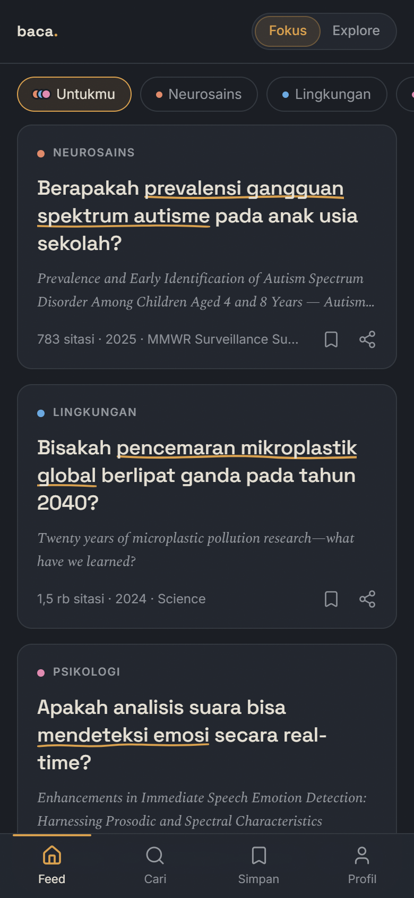
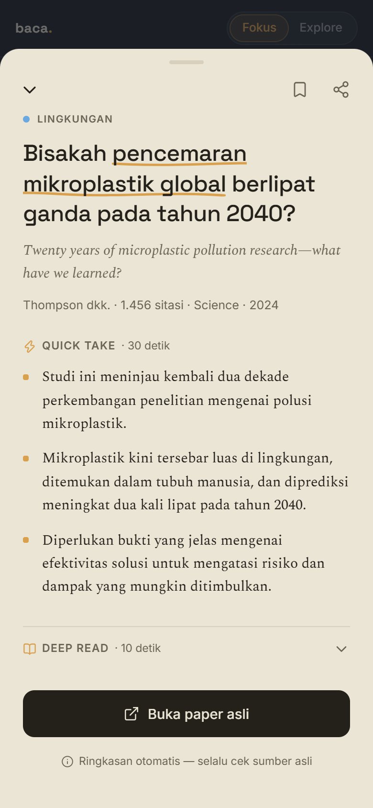
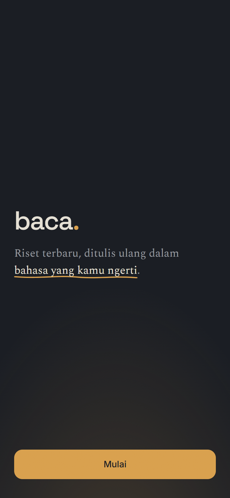
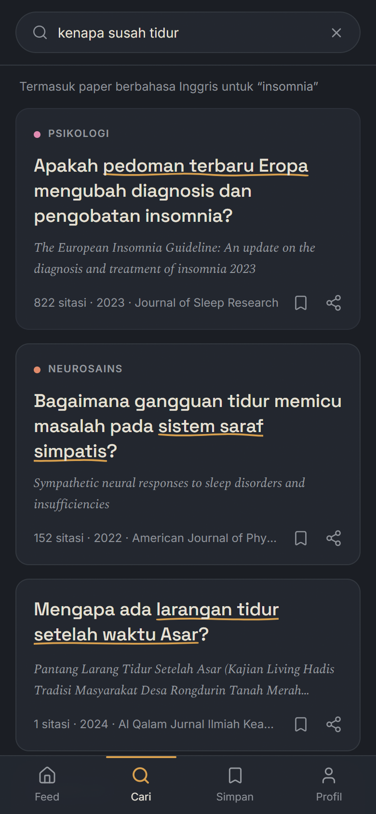

# baca.

**Riset terbaru, ditulis ulang dalam bahasa yang kamu ngerti.**

Platform baca paper akademis bergaya feed — bukan mesin pencari seperti Google
Scholar, tapi feed yang *mendatangkan* riset relevan seperti FYP TikTok. Setiap
paper dibuka dengan satu pertanyaan Bahasa Indonesia, bukan judul berbahasa
Inggris sepanjang tiga baris.

**[→ Coba langsung: baca-three.vercel.app](https://baca-three.vercel.app)**

> **In English.** *baca.* ("read") is a feed-first reading app for open-access
> academic papers, built for Indonesian readers. Instead of a search box, it
> surfaces papers the way a social feed does; instead of an English title, each
> card leads with a one-sentence Indonesian question generated from the paper's
> abstract, followed by a three-bullet summary and a deeper paragraph. Papers
> come from [OpenAlex](https://openalex.org), summaries from the Gemini API. The
> whole app works without an account — personalization lives on the device.

---

## Tampilan

| Feed "Untukmu" | Reading view |
|---|---|
|  |  |

| Onboarding | Pencarian lintas bahasa |
|---|---|
|  |  |

---

## Masalah yang dipecahkan

Riset terbuka jumlahnya melimpah, tapi praktis tidak terbaca orang awam
Indonesia karena tiga hambatan: hampir semuanya berbahasa Inggris, judulnya
ditulis untuk sesama peneliti, dan untuk menemukannya kamu harus sudah tahu apa
yang dicari.

*baca.* menyerang ketiganya:

- **Bahasa** — ringkasan dibuat ulang dalam Bahasa Indonesia, bukan diterjemahkan
  mentah. Pencarian pun menerima bahasa sehari-hari: "kenapa susah tidur"
  otomatis ikut mencari *insomnia*.
- **Judul** — tiap kartu dipimpin satu pertanyaan pendek yang lahir dari
  abstraknya sendiri, jadi kamu tahu kenapa paper itu menarik sebelum membacanya.
- **Penemuan** — tidak ada kolom pencarian di halaman depan. Feed yang datang
  ke kamu, bukan sebaliknya.

## Keputusan teknis yang menarik

Bagian ini yang mungkin paling relevan kalau kamu membaca repo ini sebagai
sesama developer.

**Endpoint AI yang tidak bisa dibajak.** `/api/summarize` hanya menerima
`paper_id` — tidak pernah teks bebas dari client. Server mengambil sendiri
abstraknya dari OpenAlex. Kalau client boleh mengirim teks, endpoint ini berubah
jadi proxy AI gratis untuk siapa pun yang menemukannya.

**Tiga lapis cache sebelum menyentuh AI.** CDN Vercel → Redis (180 hari) →
Gemini. Ringkasan satu paper sama untuk semua orang, jadi paper populer praktis
tidak pernah dibayar dua kali. Ringkasan yang sudah ada bahkan ikut terkirim
bersama respons feed, sehingga layar pertama tidak memanggil endpoint AI sama
sekali.

**Kuota AI dijaga, bukan dibiarkan gagal.** Free tier Gemini menolak lebih dari
15 permintaan per menit. Alih-alih menampilkan pesan gagal, ada penjatah global
di Redis: permintaan berlebih dibalas `503` beserta `Retry-After`, kartunya tetap
menampilkan placeholder, lalu mencoba lagi sendiri. Uji 20 permintaan serentak:
12 berhasil, 8 menunggu, **nol gagal**.

**Personalisasi tanpa akun, tanpa mengirim riwayat baca.** Feed "Untukmu"
mencampur topik pilihan dengan bobot dari kebiasaan membaca — dan seluruh
sinyalnya tidak pernah meninggalkan perangkat. Riwayat baca disaring di browser,
bukan dikirim sebagai parameter. Efek sampingnya justru menguntungkan: karena
URL feed jadi identik untuk semua orang, CDN bisa menyajikannya — pengunjung
kedua mendapat feed dalam **0,2 detik**.

**Bobot topik yang sengaja dibatasi.** Rumusnya `1 + (dibuka + 3×disimpan)/10`,
dijepit di rentang 1–4. Batas bawah menjamin topik yang jarang dibuka tetap
muncul, supaya feed tidak menyempit jadi ruang gema; batas atas menjaga topik
favorit tidak menelan sisanya.

**Anti-halusinasi sebagai syarat, bukan harapan.** Prompt melarang menambah
klaim di luar abstrak, dan hasil model divalidasi ketat sebelum dipercaya —
misalnya frasa yang di-highlight wajib substring persis dari pertanyaannya,
kalau tidak cocok highlight-nya dibuang. Tiap ringkasan menyertakan tautan ke
paper asli.

## Identitas visual: "Meja Baca Saat Senja"

Dua keadaan berbeda saat membaca, dan app-nya berpindah di antara keduanya:
**menjelajah** (meja gelap-hangat, santai) dan **membaca** (halaman terang naik
ke bawah lampu, dunia meredup). Aksen warnanya tunggal — amber — dan frasa kunci
digarisbawahi coretan tangan yang varian bentuknya diturunkan dari ID paper,
jadi tidak pernah seragam seperti garis digital.

Design token, tipografi, dan checklist "anti-AI-slop"-nya didokumentasikan di
[`docs/SPEC.md`](./docs/SPEC.md) Bagian 3.

## Performa

Lighthouse mobile terhadap URL produksi:

| Halaman | Performance | Aksesibilitas | CLS |
|---|---|---|---|
| /onboarding | 95 | 100 | 0 |
| /search | 88–94 | 100 | 0 |
| /feed | 90 | 100 | 0 |

`CLS 0` di semua halaman — kartu tidak pernah meloncat saat ringkasan AI masuk,
karena tinggi slotnya sudah dipesan sejak awal. PageSpeed Insights memberi
Aksesibilitas, Best Practices, dan SEO **100** di mobile maupun desktop.

`/feed` masih pas di angka 90, belum melewati standar yang ditetapkan di SPEC
(> 90); kandidat perbaikan berikutnya tercatat di
[`docs/SPEC.md`](./docs/SPEC.md) Bagian 2.

## Stack

Next.js 16 (App Router) · TypeScript · Tailwind CSS v4 · Framer Motion ·
Upstash Redis · Gemini API · OpenAlex API · PWA (Serwist) · Vercel

## Dokumentasi

[`docs/SPEC.md`](./docs/SPEC.md) adalah sumber kebenaran tunggal proyek ini —
memuat keputusan produk, kontrak API, skema data, identitas visual, dan catatan
verifikasi setiap kali asumsi diuji terhadap API yang sebenarnya. Dokumen itu
ditulis sebelum kodenya ada, lalu diperbarui setiap kali sebuah keputusan
berubah selama membangun.

## Menjalankan secara lokal

```bash
git clone https://github.com/muhimranhidayathamzh/baca.git
cd baca
npm install
cp .env.example .env.local   # isi key-nya, lihat di bawah
npm run dev
```

Buka [localhost:3000](http://localhost:3000).

Semua key boleh dikosongkan dulu: feed dan pencarian tetap jalan (OpenAlex bisa
diakses tanpa key, rate limit memakai fallback in-memory), hanya ringkasan AI
yang belum aktif sampai `GEMINI_API_KEY` diisi. Cara mendapatkan tiap key ada di
komentar [`.env.example`](./.env.example) dan `docs/SPEC.md` Bagian 8.

> **Di produksi, kredensial Upstash wajib.** Rate limiting sengaja *fail closed*
> — tanpa Redis, semua API route membalas 429. Ini disengaja, bukan bug.

Build produksi memakai `npm run build`, yang sudah memakai `--webpack` karena
service worker PWA-nya di-bundle plugin webpack Serwist.

## Lisensi

[MIT](./LICENSE)

Data paper berasal dari [OpenAlex](https://openalex.org) (CC0). Ringkasan
dihasilkan AI — selalu periksa sumber aslinya.
